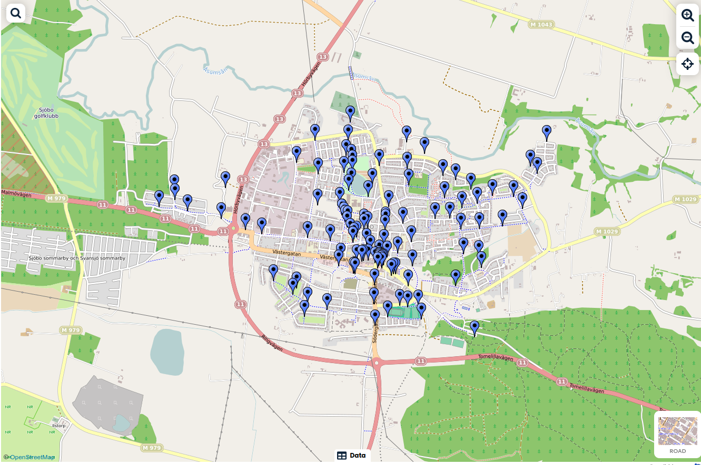

# soprundan-sjobo
Gatukontoret tömmer offentliga sopkorgar i Sjöbo tätort. Det finns totalt cirka 120 sopkorgar och tar två personer en arbetsdag att tömma alla sopkorgar. Syftet med projektet är att markera ut sopkorgarna på en karta och ge ett exempel på bästa körväg genom Sjöbo tätort för att tömma sopkorgarna
## Sopkorgar
https://www.scribblemaps.com/maps/view/soprundan/sjobo 

## Bästa körväg
Västergatan 
Gamlatorg 
Östergatan 
Oran 
Idrottsplatsen 
Södergatan 
Busstationen 
Backarna 
Tillsynsrundan/Mossen 
Aktivitetsparken 
Malenas Park 
Hästtorget 
Ängsgatan 
Kärnan 
Planteringsgatan 
Industrigatan 
Ommavägen 
Jysk/Vändplats 
Sjöbo Väst 
Kunskapsområdet 
Gallaxområdet 
Långdansvägen 
Grönsaksvägen 
Föreningsgatan 
Hundparken 
Norregatan 